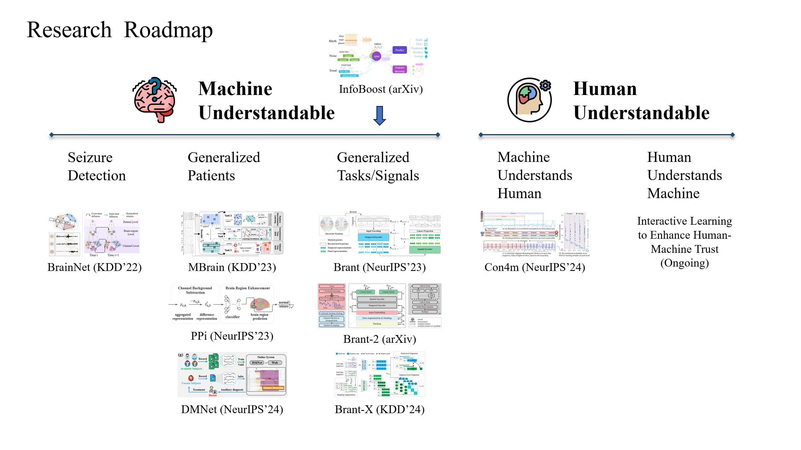

# 📝 Publications 

## Exploring foundation model for brain signals

> In 2024, I joined the Brainnet group and participated in the research of large brain electrical models. Below is the roadmap of Brainnet group's research.

> 

> Our goal is to establish a universal brain signal model to improve the performance of various downstream tasks in the healthcare field and provide a quantitative understanding of brain activity in human neuroscience.

I am pleased to have contributed to [BrainWave](https://arxiv.org/abs/2402.10251), my first published research paper. This research introduces the first foundation model for both invasive and non-invasive neural recordings, composed of three main components: embedding layer, Transformer encoder and channel attention. This model will facilitate a wide range of clinical
applications in medicine, paving the way for AI-driven approaches to investigate brain disorders and advance neuroscience research.

arXiv preprint

BrainWave: A Brain Signal Foundation Model for Clinical Applications \\
Zhizhang Yuan, **Fanqi Shen**, Meng Li, Yuguo Yu, Chenhao Tan, [Yang Yang](http://yangy.org/)\\
This research introduces the first foundation model for both invasive and non-invasive neural recordings.

<!-- 
 

We aim to establish a universal model for brain signals, enhancing performance in various downstream tasks within the healthcare domain 
while empowering a quantitative understanding of brain activity in neuroscience for human.

Starting from a real medical scenario—seizure detection, our goal is to automatically identify epileptic waves in intracranial brain signals 
for medication-resistant patients, expediting the localization of lesions within the brain. Inspired by neuroscience research, we initially 
attempt to model the diffusion patterns of epileptic waves for individual patients ([BrainNet, KDD'22](https://arxiv.org/pdf/2306.13101)). 
Subsequently, we employ self-supervised learning to capture universal spatio-temporal correlations between signals from different brain regions, 
facilitating generalization to different patients ([MBrain, KDD'23](https://arxiv.org/pdf/2306.13102); 
[PPi, NeurIPS'23](https://openreview.net/pdf?id=tEmFyqjaJh); DMNet, NeurIPS'24).

To construct a foundational model, we first attempt to pretrain a foundational model with 500M parameters based on a large volume of 
intracranial brain signals ([Brant, NeurIPS'23](https://openreview.net/pdf?id=DDkl9vaJyE)). Subsequently, we integrate EEG into the pretraining corpus, 
building a foundational model with 1B parameters, thereby generalizing to a broader range of downstream tasks such as sleep staging and 
emotion recognition ([Brant-2, arXiv](https://arxiv.org/pdf/2402.10251)). Leveraging the strong generalization of Brant-2, we propose a 
unified alignment framework ([Brant-X, KDD'24](https://dl.acm.org/doi/pdf/10.1145/3637528.3671953)) to rapidly adapt Brant-2 to downstream tasks 
involving rare physiological signals (e.g., EOG/ECG/EMG).
In our pursuit to construct a universal foundational model, we recognize the necessity for a comprehensive dataset encompassing a wide array of domains. 
Given the scarcity of brain signal data, we explore a diffusion-based model for intracranial brain signals generation (NeuralDiff, under review). Furthermore, 
we innovate to directly synthesize infinite sequences, thereby circumventing the dependence on actual data ([InfoBoost, arXiv](http://arxiv.org/abs/2402.00607)).

To enhance mutual understanding and trust between humans and machines, we first propose a consistency learning framework that enables models 
to understand human input and adaptively harmonize annotations from different individuals ([Con4m, NeurIPS'24](https://arxiv.org/pdf/2408.00041)). 
Additionally, we are developing connections between foundational models and human-understandable modalities, and exploring interactive learning 
between models and humans.

NeurIPS 2024

[Con4m: Context-aware Consistency Learning Framework for Segmented Time Series Classification](https://arxiv.org/pdf/2408.00041) \\
**Junru Chen**, [Tianyu Cao](http://tiyacao.com/), Jing Xu, [Jiahe Li](https://erikaqvq.github.io/), Zhilong Chen, Tao Xiao, [Yang Yang](http://yangy.org/)\\
Con4m is a consistency learning framework, which effectively utilizes contextual information more conducive to 
discriminating consecutive segments in segmented TSC tasks, while harmonizing inconsistent boundary labels for training.

NeurIPS 2024

DMNet: Self-comparison Driven Model for Subject-independent Seizure Detection \\
Shihao Tu, [Linfeng Cao](https://caolinfeng.github.io/homepage/), [Daoze Zhang](https://daozezhang.github.io/), 
**Junru Chen**, Lvbin Ma, Yin Zhang, [Yang Yang](http://yangy.org/) \\
Difference Matrix-based Neural Network (DMNet) addresses the domain shift in iEEG signals across different subjects by 
leveraging a self-comparison mechanism for subject-independent automatic seizure detection.

KDD 2024

[Brant-X: A Unified Physiological Signal Alignment Framework](https://dl.acm.org/doi/pdf/10.1145/3637528.3671953) \\
[Daoze Zhang](https://daozezhang.github.io/), Zhizhang Yuan, **Junru Chen**, Kerui Chen, [Yang Yang](http://yangy.org/)\\
[code ](https://github.com/zjunet/Brant-X/)\\
Brant-X is a unified physiological signal alignment framework to learn representations from various physiological data.

arXiv preprint

[Brant-2: Foundation Model for Brain Signals](https://arxiv.org/pdf/2402.10251) \\
Zhizhang Yuan, [Daoze Zhang](https://daozezhang.github.io/), **Junru Chen**, [Gefei Gu](https://frankgu3528.github.io/), [Yang Yang](http://yangy.org/)\\
[code ](https://github.com/yzz673/Brant-2)\\
Brant-2 is the first large-scale, off-the-shelf model that can be applied to the application scenrios of both SEEG and EEG.

NeurIPS 2023

[Brant: Foundation Model for Intracranial Neural Signal](https://openreview.net/pdf?id=DDkl9vaJyE)\\
[Daoze Zhang](https://daozezhang.github.io/)\*, Zhizhang Yuan\*, [Yang Yang](http://yangy.org/), **Junru Chen**, Jingjing Wang, Yafeng Li
(*: equal contribution)\\
[Homepage](https://zju-brainnet.github.io/Brant.github.io/) \|
[code ](https://github.com/yzz673/Brant)\\
Brant is a foundation model in the field of intracranial recordings, which learns powerful representations of intracranial neural signals.

NeurIPS 2023

[PPi: Pretraining Brain Signal Model for Patient-independent Seizure Detection](https://openreview.net/pdf?id=tEmFyqjaJh)\\
Zhizhang Yuan\*, [Daoze Zhang](https://daozezhang.github.io/)\*, [Yang Yang](http://yangy.org/), **Junru Chen**, Yafeng Li (*: equal contribution)\\
[code ](https://github.com/yzz673/PPi)\\
PPi is a pretraining-based model to conduct patient-independent seizure detection on SEEG in the clinical scenario.

KDD 2023

[MBrain: A Multi-channel Self-Supervised Learning Framework for Brain Signals](https://arxiv.org/pdf/2306.13102)\\
[Donghong Cai](https://ilikevegetable.github.io/)\*, **Junru Chen**\*, [Yang Yang](http://yangy.org/), [Teng Liu](27rabbitlt.github.io), 
Yafeng Li (*: equal contribution)\\
MBrain is a generalized self-supervised learning framework, which can be applied to pre-train both EEG and SEEG signals.

KDD 2022

[BrainNet: Epileptic Wave Detection from SEEG with Hierarchical Graph Diffusion Learning](https://arxiv.org/pdf/2306.13101)\\
**Junru Chen**\*, [Yang Yang](http://yangy.org/)\*, Tao Yu, Yingying Fan, Xiaoling Mo, [Carl Yang](http://www.cs.emory.edu/~jyang71/) (*: equal contribution)\\
BrainNet is a model that jointly learns the dynamic diffusion graphs and models the brain wave diffusion patterns thereon to achieve accurate epileptic wave detection.

## Explore the robustness of graphs

AAAI 2022

[Unsupervised Adversarially-Robust Representation Learning on Graphs](https://arxiv.org/pdf/2012.02486)\\
[Jiarong Xu](https://galina0217.github.io/), [Yang Yang](http://yangy.org/), **Junru Chen**, Chunping Wang, [Xin Jiang](https://jiangxjames.github.io/), 
[Jiangang Lu](https://person.zju.edu.cn/en/lujg), [Yizhou Sun](https://web.cs.ucla.edu/~yzsun/)\\
[code ](https://github.com/galina0217/robustgraph)\\
We propose a robust graph pre-trained model, such that the adversarial attacks on the input graph can be successfully identifed and 
blocked before being propogated to different downstream tasks.

`AI Open` [Robustness of Deep Learning Models on Graphs: A Survey](https://galina0217.github.io/works/robust_survey.pdf)\\
[Jiarong Xu](https://galina0217.github.io/), **Junru Chen**, Siqi You, Zhiqing Xiao, [Yang Yang](http://yangy.org/), [Jiangang Lu](https://person.zju.edu.cn/en/lujg)
  -->